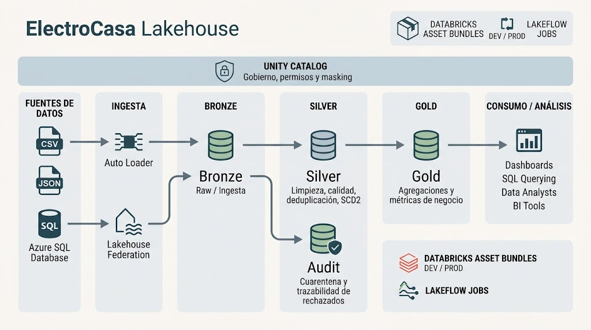
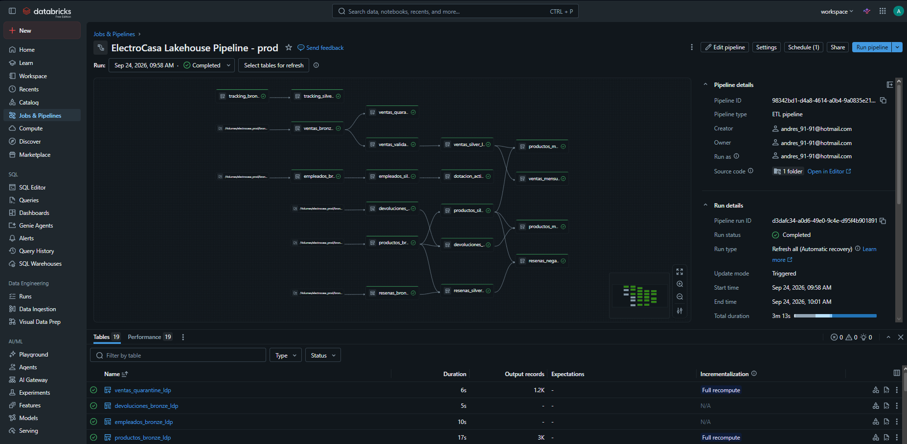
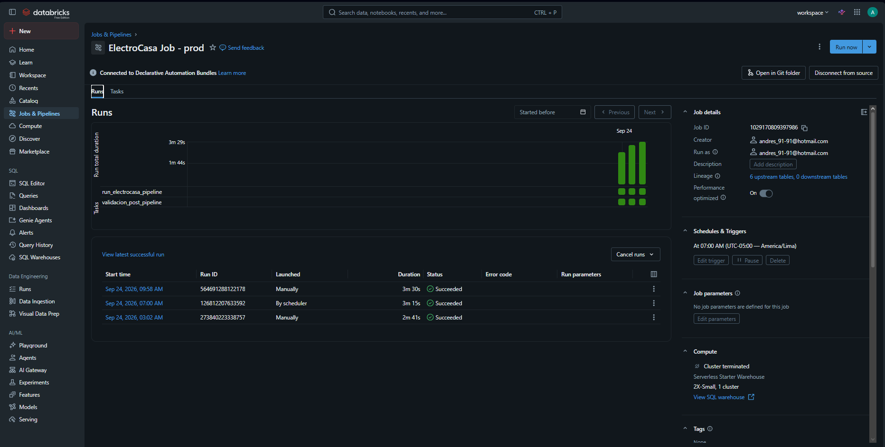

# ElectroCasa Lakehouse

Proyecto integrador desarrollado en Databricks para implementar una plataforma Lakehouse orientada al procesamiento y análisis de información de ElectroCasa.

La solución integra datos de ventas, productos, empleados, reseñas de clientes, devoluciones y tracking de envíos. Se implementó una arquitectura Medallion con capas Bronze, Silver y Gold, controles de calidad, trazabilidad de registros rechazados, historización de empleados, gobierno mediante Unity Catalog, orquestación con Lakeflow Jobs y despliegue mediante Databricks Asset Bundles.

El proyecto cuenta con dos ambientes independientes:

- Desarrollo: `electrocasa_dev`
- Producción: `electrocasa_prod`

La misma base de código se utiliza para ambos ambientes.

---

## 1. Objetivo del proyecto

El objetivo fue construir un pipeline de datos de punta a punta que permita:

- integrar distintas fuentes de información;
- conservar trazabilidad sobre los datos cargados;
- limpiar y estandarizar información;
- detectar y separar registros inválidos;
- mantener historial de cambios de empleados;
- generar información agregada para análisis de negocio;
- proteger información sensible;
- automatizar la ejecución mediante Jobs;
- desplegar la solución en DEV y PROD utilizando el mismo repositorio.

---

## 2. Arquitectura implementada

La solución utiliza una arquitectura Medallion.

### Bronze

Contiene la información recibida desde las fuentes originales con el menor nivel posible de transformación.

Se agregan columnas técnicas para trazabilidad de la ingesta.

### Silver

Contiene la información limpia, normalizada, deduplicada y validada.

En esta capa también se implementan:

- reglas de calidad;
- normalización de fechas;
- estandarización de valores;
- historización de empleados;
- protección de campos sensibles.

### Gold

Contiene información agregada y preparada para análisis de negocio.

### Audit

Se utiliza para conservar registros rechazados por determinadas reglas de calidad, permitiendo conocer qué registro falló, su origen y el motivo.

El flujo general es:

```text
CSV / JSON                     Azure SQL Database
    |                                  |
    | Auto Loader                      | Lakehouse Federation
    |                                  |
    +----------------+-----------------+
                     |
                   Bronze
                     |
             Limpieza y calidad
                     |
             +-------+-------+
             |               |
           Audit           Silver
                             |
                         Transformación
                             |
                           Gold
                             |
                     Consumo / análisis
```

### Evidencia de arquitectura


---

## 3. Fuentes de datos

Se utilizaron seis fuentes.

| Fuente | Origen | Método de ingesta |
|---|---|---|
| Ventas | CSV | Auto Loader |
| Productos | JSON | Auto Loader |
| Empleados | CSV | Auto Loader |
| Reseñas | JSON | Auto Loader |
| Devoluciones | CSV | Auto Loader |
| Tracking de envíos | Azure SQL Database | Lakehouse Federation |

Los archivos se almacenan en un Volume de Unity Catalog utilizando una estructura por fuente.

Ejemplo:

```text
/Volumes/electrocasa_dev/bronze/landing/
├── productos/
├── ventas/
├── devoluciones/
├── resenas/
└── empleados/
```

En producción se utiliza la misma estructura bajo:

```text
/Volumes/electrocasa_prod/bronze/landing/
```

Para evitar tener rutas distintas escritas directamente en el código, el catálogo es parametrizado mediante:

```text
${electrocasa_catalog}
```

Por ejemplo:

```sql
'/Volumes/${electrocasa_catalog}/bronze/landing/ventas/'
```

En DEV el parámetro toma el valor:

```text
electrocasa_dev
```

y en PROD:

```text
electrocasa_prod
```

---

## 4. Capa Bronze

La capa Bronze recibe los datos de las fuentes y conserva información técnica que permite identificar cómo y cuándo ingresó cada registro.

Entre las columnas utilizadas para auditoría se encuentran:

```text
_ingested_at
_source_file
_batch_id
```

Las tablas principales son:

```text
productos_bronze_ldp
ventas_bronze_ldp
devoluciones_bronze_ldp
resenas_bronze_ldp
empleados_bronze_ldp
tracking_bronze_ldp
```

Para las fuentes CSV y JSON se utilizó Auto Loader.

El tracking de envíos se obtiene desde Azure SQL Database mediante Lakehouse Federation.

Esta decisión evita copiar previamente la información de tracking a un archivo dentro de Databricks.

---

## 5. Calidad y transformación en Silver

La capa Silver concentra la mayor parte de las reglas de limpieza y calidad.

Se realizaron, entre otras, las siguientes transformaciones:

- eliminación de espacios innecesarios;
- normalización de mayúsculas y minúsculas;
- conversión segura de tipos de datos;
- estandarización de categorías;
- estandarización de métodos de pago;
- normalización de estados de envío;
- tratamiento de fechas en distintos formatos;
- deduplicación;
- validación de referencias entre productos y otras fuentes;
- tratamiento de estructuras JSON;
- validación de valores nulos o inválidos.

Las principales tablas Silver son:

```text
productos_silver_ldp
ventas_validas_ldp
ventas_silver_ldp
devoluciones_silver_ldp
resenas_silver_ldp
empleados_silver_ldp
tracking_silver_ldp
```

---

## 6. Reglas de calidad

Durante la revisión de las fuentes se encontraron problemas de calidad incorporados intencionalmente en los datos.

Entre ellos:

### Ventas

Se encontraron registros con:

- monto negativo;
- monto igual a cero;
- cantidad inválida;
- sucursal vacía;
- métodos de pago escritos de diferentes maneras;
- fechas con diferentes formatos.

Para ventas se aplicaron Expectations en Lakeflow.

Ejemplo:

```sql
CONSTRAINT monto_total_positivo
    EXPECT (monto_total > 0)
    ON VIOLATION DROP ROW
```

También se validó:

```text
cantidad > 0
sucursal_id no vacío
```

### Productos

Se validó que:

```text
precio_lista > 0
```

Además se normalizaron categorías y registros duplicados.

### Reseñas

La calificación debe encontrarse entre:

```text
1 y 5
```

Los valores fuera de rango son descartados de Silver.

### Devoluciones

Se valida que:

```text
monto_reembolso >= 0
```

y que el producto exista en el catálogo.

### Tracking

Los estados se normalizan a:

```text
entregado
en_transito
pendiente
devuelto
```

---

## 7. Tabla de cuarentena

Los registros inválidos de ventas no se eliminan sin dejar evidencia.

Se creó:

```text
audit.ventas_quarantine_ldp
```

Esta tabla conserva registros que presentan errores críticos.

Entre los motivos registrados se encuentran:

```text
MONTO_TOTAL_INVALIDO
CANTIDAD_INVALIDA
SUCURSAL_ID_VACIA
```

También se conserva información de auditoría:

```text
source_file
batch_id
fecha_procesamiento
```

Esto permite revisar posteriormente los registros rechazados y conocer de qué carga provienen.

---

## 8. Historización de empleados

La fuente de empleados contiene eventos de:

```text
alta
transferencia
cambio_salario
baja
```

Para evitar perder información anterior cuando cambia el estado de un empleado se implementó una lógica de historización tipo SCD2.

La tabla resultante es:

```text
empleados_silver_ldp
```

Se utilizan campos como:

```text
vigencia_desde
vigencia_hasta_exclusiva
es_actual
estado_empleado
```

Esto permite consultar tanto el estado actual como el historial del empleado.

Por ejemplo, si un empleado cambia de sucursal o recibe una modificación salarial, la versión anterior no se sobrescribe.

---

## 9. Protección de información sensible

Los datos de empleados contienen información sensible, principalmente:

```text
dni
salario
```

Por este motivo se implementaron funciones de masking mediante Unity Catalog.

Funciones utilizadas:

```text
mask_dni
mask_salario
```

Las funciones están creadas en cada ambiente.

DEV:

```text
electrocasa_dev.silver.mask_dni
electrocasa_dev.silver.mask_salario
```

PROD:

```text
electrocasa_prod.silver.mask_dni
electrocasa_prod.silver.mask_salario
```

Dentro del pipeline se utilizan mediante el catálogo parametrizado:

```sql
dni STRING MASK ${electrocasa_catalog}.silver.mask_dni
```

y:

```sql
salario DECIMAL(18,2)
    MASK ${electrocasa_catalog}.silver.mask_salario
```

De esta forma no fue necesario mantener una versión diferente del código para DEV y PROD.

---

## 10. Gobierno de datos

Unity Catalog se utilizó como mecanismo principal de gobierno.

Se trabajó con los siguientes schemas:

```text
bronze
silver
gold
audit
```

También se crearon grupos con diferentes niveles de acceso.

### Ingeniería

Grupo utilizado para el equipo encargado de desarrollar y mantener los pipelines.

Cuenta con permisos para trabajar sobre las diferentes capas del Lakehouse.

### Analistas

Orientado al consumo de información preparada para análisis.

Su acceso se concentra principalmente en Gold.

### Auditoría

Permite revisar información necesaria para trazabilidad y control.

Los permisos fueron asignados mediante `GRANT` y se incorporaron al proceso de aprovisionamiento del proyecto.

---

## 11. Capa Gold

Gold contiene información preparada para responder preguntas de negocio.

### Ventas mensuales por sucursal

Tabla:

```text
ventas_mensuales_sucursal_ldp
```

Permite analizar ventas por:

```text
sucursal
mes
```

y obtener métricas comerciales agregadas.

---

### Productos más vendidos

Tabla:

```text
productos_mas_vendidos_ldp
```

Permite identificar productos con mayor cantidad vendida.

---

### Productos más devueltos

Tabla:

```text
productos_mas_devueltos_ldp
```

Permite identificar productos con mayor número de devoluciones.

---

### Dotación activa

Tabla:

```text
dotacion_activa_sucursal_ldp
```

Utiliza la información historizada de empleados para determinar la cantidad actual de trabajadores por sucursal.

---

### Reseñas negativas

Tabla:

```text
resenas_negativas_categoria_ldp
```

Permite analizar el volumen de reseñas negativas agrupadas por categoría de producto.

---

## 12. Lakeflow Declarative Pipeline

Las tres capas se implementaron mediante Lakeflow Declarative Pipelines.

El código se encuentra separado por capa:

```text
src/electrocasa/transformations/
├── 01_bronze.sql
├── 02_silver.sql
└── 03_gold.sql
```

Las dependencias entre las tablas son determinadas por Lakeflow a partir de las relaciones existentes entre las consultas.

El pipeline utiliza Serverless Compute.

---

## 13. Orquestación con Lakeflow Jobs

Se creó un Job encargado de ejecutar el procesamiento completo.

El flujo del Job es:

```text
run_electrocasa_pipeline
          |
          v
validacion_post_pipeline
```

### Primera tarea

Ejecuta:

```text
electrocasa_pipeline
```

y procesa Bronze, Silver, Audit y Gold.

### Segunda tarea

Ejecuta:

```text
validacion_post_pipeline
```

Esta tarea realiza comprobaciones posteriores a la ejecución del pipeline.

Entre las validaciones realizadas se revisa que:

- las tablas Gold tengan información;
- las métricas esperadas hayan sido generadas;
- no existan registros inválidos en la tabla de ventas válidas.

La tarea SQL se encuentra en:

```text
src/electrocasa/validations/
└── validacion_post_pipeline.sql
```

También se configuraron reintentos y dependencias entre tareas.

---

## 14. Programación

El Job se encuentra configurado con ejecución programada.

Zona horaria:

```text
America/Lima
```

Esto permite que el proceso completo pueda ejecutarse automáticamente sin intervención manual.

---

## 15. Databricks Asset Bundles

La infraestructura del proyecto se administra mediante Databricks Asset Bundles.

La estructura principal del repositorio es:

```text
electrocasa-lakehouse/
│
├── databricks.yml
│
├── README.md
│
├── resources/
│   ├── electrocasa_pipeline.yml
│   └── electrocasa_job.yml
│
├── src/
│   └── electrocasa/
│       ├── transformations/
│       │   ├── 01_bronze.sql
│       │   ├── 02_silver.sql
│       │   └── 03_gold.sql
│       │
│       ├── validations/
│       │   └── validacion_post_pipeline.sql
│       │
│       └── utils/
│
├── notebooks/
│   ├── 00_setup.ipynb
│   └── 01_governance.sql
│
└── docs/
    └── images/
```

Los recursos no se encuentran definidos directamente dentro de `databricks.yml`.

Se encuentran separados en:

```text
resources/electrocasa_pipeline.yml
resources/electrocasa_job.yml
```

---

## 16. Ambientes DEV y PROD

El Bundle cuenta con dos targets.

### DEV

Catálogo:

```text
electrocasa_dev
```

Se utiliza para desarrollo, pruebas y validación de cambios.

### PROD

Catálogo:

```text
electrocasa_prod
```

Se utiliza para la ejecución final del proyecto.

El catálogo se configura mediante una variable del Bundle:

```text
${var.catalog}
```

y posteriormente se transmite al pipeline mediante:

```yaml
configuration:
  electrocasa_catalog: ${var.catalog}
```

Esto permite utilizar la misma base de código para los dos ambientes.

---

## 17. Despliegue

El proyecto puede ser desplegado desde Databricks CLI.

### Validar DEV

```bash
databricks bundle validate -t dev
```

Resultado obtenido:

```text
Validation OK!
```

### Desplegar DEV

```bash
databricks bundle deploy -t dev
```

### Ejecutar Pipeline DEV

```bash
databricks bundle run -t dev electrocasa_pipeline
```

Resultado final:

```text
COMPLETED
```

### Ejecutar Job DEV

```bash
databricks bundle run -t dev electrocasa_job
```

Resultado final:

```text
TERMINATED SUCCESS
```

---

### Validar PROD

```bash
databricks bundle validate -t prod
```

Resultado:

```text
Validation OK!
```

### Desplegar PROD

```bash
databricks bundle deploy -t prod
```

### Ejecutar Pipeline PROD

```bash
databricks bundle run -t prod electrocasa_pipeline
```

Resultado:

```text
COMPLETED
```

### Ejecutar Job PROD

```bash
databricks bundle run -t prod electrocasa_job
```

Resultado:

```text
TERMINATED SUCCESS
```

---

## 18. Evidencia de ejecución

### Pipeline de producción

La ejecución final del pipeline de producción pasó por los estados:

```text
WAITING_FOR_RESOURCES
INITIALIZING
SETTING_UP_TABLES
RUNNING
COMPLETED
```

Durante la ejecución se procesaron correctamente las capas:

```text
Bronze
Silver
Audit
Gold
```

El resultado final fue:

```text
Update 1ecad7 is COMPLETED
```

### Evidencia



---

### Job de producción

Se ejecutó:

```bash
databricks bundle run -t prod electrocasa_job
```

El resultado final obtenido fue:

```text
"ElectroCasa Job - prod" TERMINATED SUCCESS
```

Esto confirma que tanto el pipeline como la validación posterior terminaron correctamente.

### Evidencia



---

## 19. Monitoreo y troubleshooting

Durante el desarrollo se utilizaron:

- historial de ejecuciones de Lakeflow;
- estados de cada Flow;
- historial de Jobs;
- Databricks CLI;
- mensajes de error del pipeline;
- consultas sobre Unity Catalog.

Durante las pruebas se resolvieron, entre otros, los siguientes problemas.

### Ownership de tablas

Inicialmente se intentó administrar desde un nuevo pipeline tablas que ya pertenecían a otro pipeline.

Databricks no permite que dos pipelines sean propietarios simultáneamente de la misma tabla.

La solución fue vincular el Bundle con el pipeline existente en lugar de crear un segundo propietario.

---

### Resolución de funciones de masking

En PROD las funciones:

```text
mask_dni
mask_salario
```

inicialmente no eran resueltas correctamente.

Se evitó escribir directamente:

```text
electrocasa_prod
```

dentro del código y se utilizó el parámetro:

```text
${electrocasa_catalog}
```

Esto permitió ejecutar exactamente los mismos archivos SQL en DEV y PROD.

---

### Parametrización de las rutas del Volume

Las rutas Bronze dependen también del catálogo.

Ejemplo:

```sql
'/Volumes/${electrocasa_catalog}/bronze/landing/ventas/'
```

El valor se configura desde:

```yaml
configuration:
  electrocasa_catalog: ${var.catalog}
```

De esta forma las rutas cambian automáticamente entre los dos ambientes.

---

## 20. Cómputo y costos

Para los pipelines se utilizó Serverless Compute.

La decisión se tomó porque el proyecto funciona mediante ejecuciones programadas y no requiere mantener un cluster activo permanentemente.

Entre las ventajas para este caso se encuentran:

- menor administración de infraestructura;
- recursos utilizados únicamente durante la ejecución;
- menor tiempo dedicado a configurar clusters;
- escalamiento administrado por Databricks.

Para un escenario productivo con mayor volumen sería necesario revisar periódicamente:

- duración de las ejecuciones;
- frecuencia de ejecución;
- volumen procesado;
- costo de serverless;
- optimización de tablas y consultas.

---

## 21. Resultado final

El proyecto quedó desplegado y validado de punta a punta.

Se completaron los siguientes componentes:

- integración de seis fuentes de datos;
- Auto Loader;
- Lakehouse Federation;
- arquitectura Bronze / Silver / Gold;
- schema de auditoría;
- tabla de cuarentena;
- reglas de calidad;
- Lakeflow Expectations;
- deduplicación;
- normalización de datos;
- SCD2 para empleados;
- masking de DNI;
- masking de salario;
- Unity Catalog;
- grupos y permisos;
- Lakeflow Declarative Pipelines;
- Lakeflow Jobs;
- validación posterior al pipeline;
- ejecución programada;
- reintentos;
- Databricks Asset Bundles;
- target DEV;
- target PROD;
- despliegue mediante CLI;
- Pipeline DEV ejecutado correctamente;
- Job DEV ejecutado correctamente;
- Pipeline PROD ejecutado correctamente;
- Job PROD ejecutado correctamente;
- versionamiento en GitHub.

